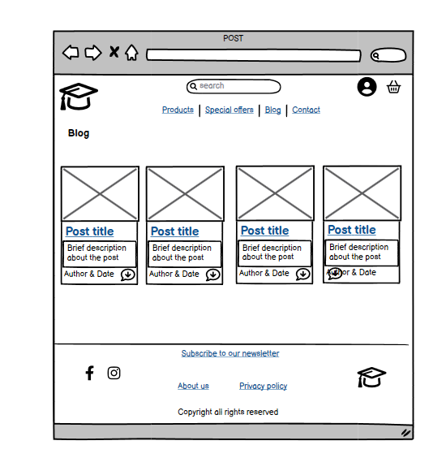
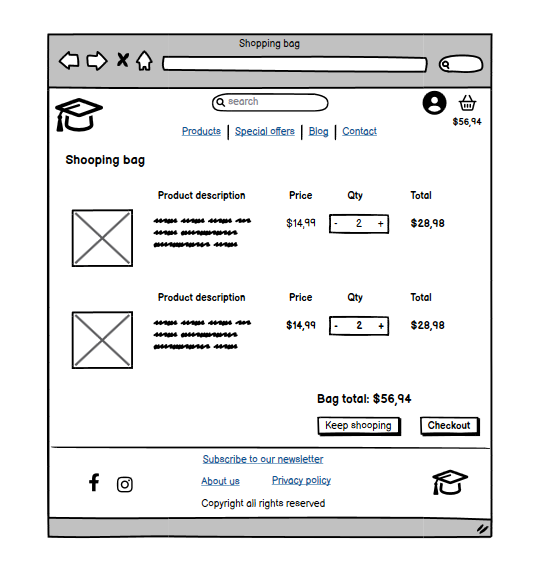

# Row to grow

Row to grow is a fictional website(for educational purposes) for a rowing community. On this website site user can find and purchase products related to rowing, as well as read recent blog posts. Site user can also subscribe to our newsletter or simply contact us for further questions. Register user can leave comments on blog posts, rate our products and save his profile/delivery information for future purchase.
 
  

[Click Here To Visit Live Site]()  

## Table Of Contents:
1. [Design & Planning](#design-&-planning)
    * [User Stories](#user-stories)
    * [Wireframes](#wireframes)
    * [Agile Methodology](#agile-methodology)
    * [Typography](#typography)
    * [Colour Scheme](#colour-scheme)
    * [Database Diagram](#database-diagram)
   
2. [Features](#features)


3. [Future Features](#future-features)
4. [Technologies Used](#technologies-used)
5. [Libraries](#libraries-used)
6. [Testing](#testing)
7. [Bugs](#bugs)
8. [Deployment](#deployment)
9. [Credits](#credits)
10. [Acknowledgements](#acknowledgements)

## Design & Planning:

### User Stories
#### Site visitor
- As a site visitor, I want be able to register for the account so that I can get more access to the website content and to store my profile information
- As a site visitor, I want to be able to view list of the products so that I can select some to purchase
- As a site visitor I want to be able to sort the list of specific category or product so that I can easily find products of certain price, rating and name
- As a site visitor I want to be able to search for a product by name or description so that I can easily find specific product
- As a site visitor, I want to be able to view details of the products so that I can identify, price, description, rating, image and available sizes of the product
- As a site visitor I want to be able to chose products and select size and quantity of the product
- As a site visitor I want to be able to pay for selected products so that I can complete my purchase option
- As a site visitor, I want be able to view blog posts so that I can get more knowledge about benefits of related selling products on the website
- As a site visitor, I want to be able to subscribe to newsletter so that I can receive promotions and informations about new products
- As a site visitor, I want to be able to contact site owner so that I can get answers to any enquires that I have about the products or website
#### Registered user
- As a registered user, I want to be able to login and logout from the website
- As a registered user, I want to be able to recove my password so that I can recover access to my account in case I forget my password
- As a registered user, I want to be able to update my profile and delivery information
- As a registered user, I want to be able to leave comments for posts so that I can engage with other users and leave feedback about certain posts
- As a registered user, I want to be able rate the products so that I can express my satisfaction or disatisfaction of the certain products
- As a registered user, I want to be able to view my order history on the profile page so that I can have better insight of my previous purchases
#### Site owner
- As a site owner, I want to be able to create, update and delete posts so that I can control my website content
- As a site owner, I want to be able to approve or delete comments so that I can filter out objectionable comments
- As a site owner, I want to be able to delete users so that I can receive several benefits such as: manage my data, reduce liability & resource optimization
- As a site owner I want to be able to add, update and delete products directly from the website so I don't have to access admin panel everytime I want to make changes to the products


### Wireframes
Below are the wireframes for the site that I created using balsamiq.
#### Desktop
<details><summary>Product page</summary>

</details>

<details><summary>Post page</summary>

</details>

<details><summary>Shooping bag</summary>

</details>

<details><summary>Checkout bag</summary>

</details>

#### Mobile
<details><summary>Product page</summary>

</details>

<details><summary>Post page</summary>

</details>

<details><summary>Shooping bag</summary>

</details>

<details><summary>Checkout bag</summary>

</details>

### Database 

<details><summary>Database</summary>

</details>

bug t-shirt product not displaying on the product page
fix spell correct in tshirt in code
bug only 4 products displayed on the page
fix removed divisible counter from walkthrough project for smaller screens and medium screens
bug webhooks not working locally for stripe payments
fix share my local workspace
bug stripe payment was incomplete (locally)
fix used test information to proceede with payments
bug order total, delivery and grand total amounts not displaying in admin panel
fix update signals.py function name, add 'self.save() in update_total function in models

# Bugs
| **Bug** | **Fix** |
| ----------- | ----------- |
| t-shirt product not displaying on the product page| spellcheck correct in tshirt in code|
| Post page was not displaying| Change path in urls.py to post/ |
| only 4 products displayed on the page | removed divisible counter from walkthrough project for smaller screens and medium screen|
| webhooks not working locally for stripe payments| clicked "share" in my local workspace|
| order total, delivery and grand total amounts not displaying in admin panel | update signals.py function name, add 'self.save() in update_total function in models |
| git push was rejected because changes I made in README.md in github, need to integrate remote changes | run commands in the console git-'fetch, checkout main, merge origin/main, commit and push" |
| server 500 error after purchase of the product on the stripe-webhook website | import stripe on the top of the webhook_handler.py |
| not able to download order receipt as pdf file | Created separated function to display blank canvas and manually inputed fields in the function|
| receipt not rendering as order history template, error "template does not exist"| created same template and placed it in the profile app |
| no autofill on the checkout page with user information| added if request.user.is_authenticated block of code with functionality in the checkout function|
| server 500 error on the live version of the website when tried to upload images from admin panel or website | removed trailing whitespace in config vars "AWS_SECRET_ACCESS_KEY"'|
| rating radio boxes on hover effect where changing colors from right to left (2 were higlighted as 4)| created div and add css to display flex, row-reverse and placed rating in that div|

# Deployment
## Create an external database

Sign in or create an account with [ElephantSQL](https://www.elephantsql.com/).

If you don't have an ElephantSql account follow the below steps:

1.  On the [Home Page](https://www.elephantsql.com/) click "Get a managed database today"
2.  Select "Try now for FREE" within the TINY TURTLE database plan
3.  Select "Log in with GitHub", select your GitHub account and click "Authorize ElephantSQL"
4.  Add your email address and click "Create team". This will crteate your ElephantSQL account.

You can now create the database for the project.

- In the ElephantSql dashboard select the "+ Create New Instance" button
- Give the instance a name and select region that is closest to your location.
- Click review button and make sure everything is inputed correctly
- Back in the ElephantSQL dashboard click the databse name you just created and copy URL


## Create an app on Heroku

Sign in or create an account with [Heroku](https://www.heroku.com/)

- In the Heroku dashboard use the New tab to create a new app.

- Name the app and choose a region.

- Click on the settings tab and select "Reveal Congig Vars".

  - Add DATABASE_URL with the value of the database URL copied from ElephantSQL

- Enter the following command in to your terminal to install dj_database and psycopg2. These are needed to connect to the database.

```pip3 install dj_database_url==0.5.0 psycopg2```

Followed by ```pip freeze > requirements.txt``` to update requirements.txt.

Add ``` import dj_database_url``` below import os in settings.py

In the DATABASES section of the settings comment out the initial settings and place the following underneath:

```
DATABASES = {
     'default': dj_database_url.parse('your-database-url-here')
 }
```

Migrate the models to the database using
```
 python3 manage.py migrate
```

Create a superuser and supply a username and password:
```
 python3 manage.py createsuperuser
```

Within the Django admin confirm the email address

Change the DATABSE settings to the following:

```
if 'DATABASE_URL' in os.environ:
    DATABASES = {
        'default': dj_database_url.parse(os.environ.get('DATABASE_URL'))
    }
else:
    DATABASES = {
        "default": {
            "ENGINE": "django.db.backends.sqlite3",
            "NAME": os.path.join(BASE_DIR, "db.sqlite3"),
        }
    }
```

Install [Gunicorn](https://gunicorn.org/) webserver:

```
pip3 install gunicorn
```

Create a file named Procfile in the root of the project and add:
```
web: gunicorn 'name-of-your-project'.wsgi:application
```

Add the required dependencies to requirements.tc with:
```
pip3 feeze > requirements
```

Add the following to settings:
```
ALLOWED_HOSTS = ["'name-of-the-website'.herokuapp.com", "localhost"]
```

Add changes, commit and push to GitHub and Heroku
```
git add . 
git commit -m "Deployment"
git push
git push heroku main
```


## Set up hosting of static and media files with AWS

1.  Sign in or create an account with [Amazon Web Server](https://aws.amazon.com/)

2.  Navigate to the AWS Console home

3.  Search for "s3" in the search bar

4.  Click on "Create bucket"

5.  In the Create bucket page add the following information:

- A name for the bucket. It is recomeneded to use the same name you gave your Heroku app.

- A region closest to you.

- Select ACLs enabled

- Uncheck the "Block all public access" checkbox

- Check the box beside "I acknowledge that the current settings might result in this bucket and the objects within becoming public."

Scroll to the bottom of the page and select "Create bucket"

6.  Click on the new bucket you just created.

7.  In the "Properties" tab scroll to the bottom of the page and in Static website hosting
click "Edit".

8.  Select "Enable" and paste the following in the the "Redirection rules – optional" at
the bottom of the page:

```
[
    {
        "AllowedHeaders": [
            "Authorization"
    ],
    "AllowedMethods": [
        "GET"
    ],
    "AllowedOrigins": [
        "*"
    ],
        "ExposeHeaders": []
    }
]
```

9.  In the "Permissions" tab click on the "Edit" button underneath Bucket policy

10.  Copy the "Bucket ARN" and click on "Policy generator"

11.  On the next page:

- Select "S3 Bucket Policy"

- Add * (an asterik) as the "Principal" value

- Select "GetObject" in the "Actions" dropdown

- Paste the "Bucket ARN" (from step 10 above) as the Amazon Resource Name (ARN)

- Click "Add Statement" then "Generate Policy"

- Copy the policy shown in the pop-up box

12.  Back in the AWS "Edit bucket policy" paste the policy just copied.

13.  At the end of the resource key but before the closing quotation mark add: 
```
/*
```

and click "Save"

14. On the next page click "Edit" in the "Access control list (ACL)" section.

- Enable "List" for "Everyone (public access)"

- Accept the warning

# Back in AWS services menu

1. Select "IAM" from the AWS menu and then "User groups" from the menu on the left 
hand side.

2.  Click the "Create group" button

3.  Give the group a name and click "Next step", then on the next page "Next step" agin.

4.  Click the "Create group" button

5.  Select "Polices" from the menu, then "Create policy" button.

6.  In the JSON tab select "Import managed policy" link

7.  Add "s3" into the search bar, select "AmazonS3FullAccess" and click "Import"

8.  Paste in the Bucket ARN and the Bucket ARN followed by /* as the Resource values

9.  Click "Review policy" and add a name and description and click "Create policy"

10.  Select "Groups" from the menu and select the group you made in Step 3.

11.  Click "Attach policy", search and select the policy just created.

12.  Click "Attach policy"

# Add a user to the group

1.  Select "Users" in the menu, then click "Add user"

2.  Add a user name and check the "Programatic access" checkbox for Access type

3.  Select "Next: Permissions"

4.  On the following page check the name of your added user group

5.  Click through the next pages until you can click the "Create user" button

6.  Navigate on user page to 'security credentials'

7. Click on 'Create access key'

8. After they are created click on 'download.csv' file


# Connect Django

1. Install boto3 and django-storages:

```
pip3 install boto3
pip3 install django-storages
```

2.  Add above to requirements.tct:
```
pip3 freeze > requirenets.txt
```

3.  Add "storages", to INSTALLED_APPS in seetings.py

4.  Paste the following in settings.py:
```
if 'USE_AWS' in os.environ:
    # Cache control
    AWS_S3_OBJECT_PARAMETERS = {
        'Expires': 'Thu, 31 Dec 2099 20:00:00 GMT',
        'CacheControl': 'max-age=94608000',
    }
    # bucket config
    AWS_STORAGE_BUCKET_NAME = 'row-to-grow'
    AWS_S3_REGION_NAME = 'eu-west-1'
    AWS_ACCESS_KEY_ID = os.environ.get('AWS_ACCESS_KEY_ID')
    AWS_SECRET_ACCESS_KEY = os.environ.get('AWS_SECRET_ACCESS_KEY')
    AWS_S3_CUSTOM_DOMAIN = f'{AWS_STORAGE_BUCKET_NAME}.s3.amazonaws.com'
```

5.  Paste the following in settings.py:
```
    # Static and media files
    STATICFILES_STORAGE = 'custom_storages.StaticStorage'
    STATICFILES_LOCATION = 'static'
    DEFAULT_FILE_STORAGE = 'custom_storages.MediaStorage'
    MEDIAFILES_LOCATION = 'media'

    # Override static and media URLs in production
    STATIC_URL = f'https://{AWS_S3_CUSTOM_DOMAIN}/{STATICFILES_LOCATION}'
    MEDIA_URL = f'https://{AWS_S3_CUSTOM_DOMAIN}/{MEDIAFILES_LOCATION}'
```

# Back in Heroku

1.  Select "Reveal Config Vars" in the "Settings" tab

2.  Add the variables "AWS_ACCESS_KEY_ID" and "AWS_SECRET_ACCESS_KEY" with the 
values from the credentails.csv file from Step 6 in Add a user to the group above

3.  Add an additioanl "USE_AWS" variable with the key of "True"


# In the root directory of the project

1.  Create a file named "custom_storages.py"

2.  Paste in the following:
```
from django.conf import settings
from storages.backends.s3boto3 import S3Boto3Storage


class StaticStorage(S3Boto3Storage):
    location = settings.STATICFILES_LOCATION


class MediaStorage(S3Boto3Storage):
    location = settings.MEDIAFILES_LOCATION
```

3.  Add and commit then push the project to GitHub. If you haven't set up automatic deployment
to Heroku, also deploy to Heroku.

 # In AWS

 1.  Add a folder named "media" in the S3 bucket page

 2.  Click "Upload" in the media folder

 3.  Select the images used on the site and click "Next"

 4.  Select "Grant public read access to this object(s)" under Manage public permissions,
 click "Next" then "Next" again

 5.   Click "Upload"

# Stripe

1.  Sign in or create an account with [Stripe](https://stripe.com/gb)

2.  Click "Developers" from the menu on the left hand side and then "API keys"

3.  Copy the "Publishable key" and "Secret key"

4.  Add these to Heroku Config Vars as STRIPE_PUBLIC_KEY and STRIPE_SECRET_KEY respectivaely.

5.  Click "Webhooks" from the Developers tab and then "+ Add endpoint"

6.  Enter the following as the "Endpoint URL":
```
https://'your-website-name'.herokuapp.com/checkout/wh/
```

7.  Select "Recieve all events" and then "Add endpoint"

8.  Copy the "Signing secret"

9.  Add the "Signing secret" to Heroku Config Vars as STRIPE_WH_SECRET

# Credits
- [w3c Markup Validator](https://validator.w3.org)
- [Am I Responsive?](http://ami.responsivedesign.is)
- [Balsamiq](https://balsamiq.com/)
- [Coolors](https://coolors.co/)
- [Design Course tutorial](https://www.youtube.com/watch?v=z9H7p1_iI14)
- [Favicon.io](https://favicon.io)
- [Font Awesome](https://fontawesome.com)
- [Free Formatter](https://www.freeformatter.com/)
- [Google Fonts](https://fonts.google.com)
- [Git](https://git-scm.com)
- [GitHub](https://github.com)
- [Pexels](https://www.pexels.com)
- [Responsinator](http://www.responsinator.com)
- [Super Cool Design](https://supercooldesign.co.uk/blog/how-to-write-good-alt-text)
- [Typespiration](https://typespiration.com)
- [xml-sitemaps.com](www.xml-sitemaps.com)
### Tutorials and inspiration

* The project walkthrough Butique Ado from Code Institute
# Acknowledgment

## Acknowledgements:
- I would like to thank my mentor ``Narander Singh`` for all his help throughout the project and guidance in general over the last 6 months. Narander was extremly proffesional and I would highly reccomend him to contionue to provide his guidance and support to the new students
- I would like to thank Code Institute in general for providing me this opportunity then Slack Community, and tutor support which were amazing. I'm not sure if they are their real names but ``Sean, Oisin, Ed, Sarah`` were there when I needed them and got stuck on my project
- I would also like to thank our cohort facilitator ``Irene Neville``, for beeing here with us for the last 6 months. Her guidance and advices made this whole experience so much better
- Last but not least I would like to thank my colleagues in the classroom for daily guidance and code review

[Back to the top](#row-to-grow)