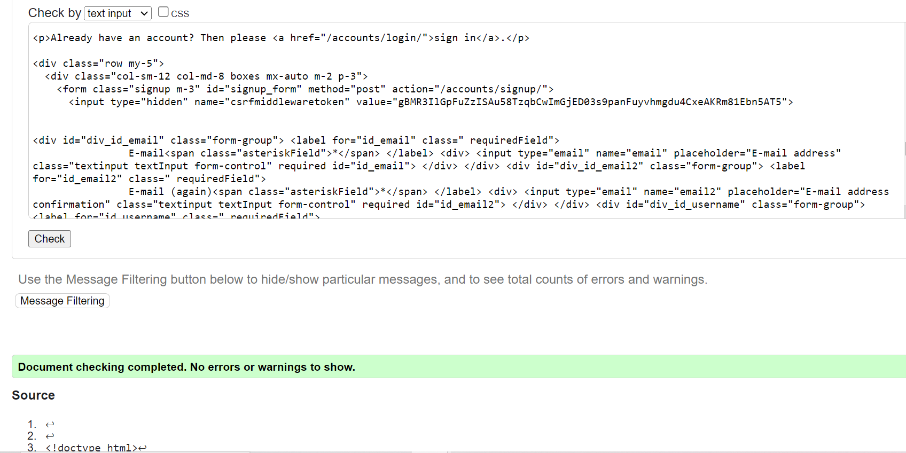
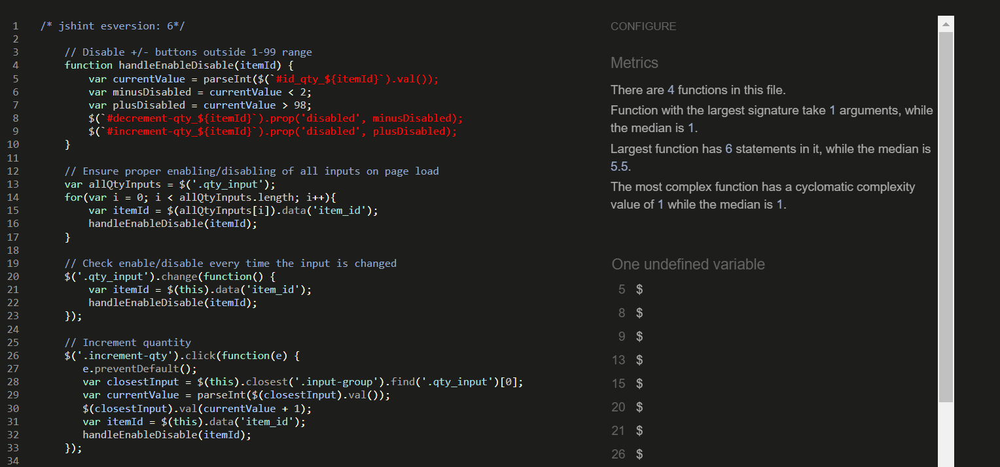
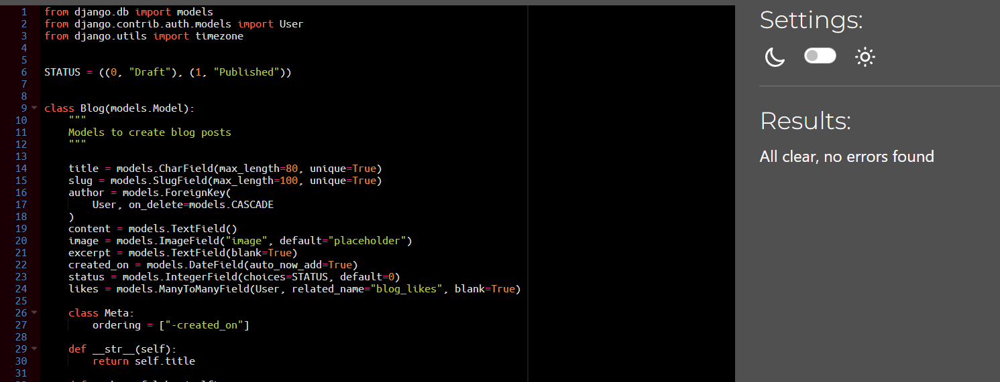
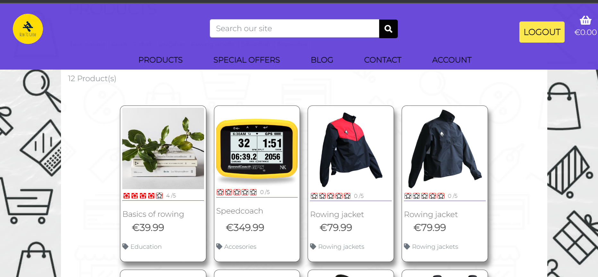

# Row to grow

Row to grow is a fictional website(for educational purposes) for a rowing community. On this website site user can find and purchase products related to rowing, as well as read recent blog posts. Site user can also subscribe to our newsletter or simply contact us for further questions. Register user can leave comments on blog posts, rate our products and save his profile/delivery information for future purchase.
 
  

[Click Here To Visit Live Site]()  

## Table Of Contents:
1. [Design & Planning](#design-&-planning)
    * [Business model](#business-model)
	* [Marketing strategies](#user-stories)
    * [SEO](#seo)
    * [User Stories](#user-stories)
    * [Wireframes](#wireframes)
    * [Agile Methodology](#agile-methodology)
    * [Typography](#typography)
    * [Color Scheme](#color-scheme)
    * [Database Diagram](#database-diagram)
2. [Features](#features)
3. [Future features](#future-features)
4. [Technologies Used](#technologies-used)
5. [Testing](#testing)
6. [Bugs](#bugs)
7. [Deployment](#deployment)
8. [Credits](#credits)
9. [Acknowledgments](#acknowledgments)

## Design & Planning:
### Business model
- Row to Grow is an e-commerce website that specializes in rowing-related products, such as clothing, accessories, and education. Our business goal is to provide high-quality products at affordable prices, with a focus on serving rowing community. We believe that by focusing on the needs of our customers and providing excellent customer service, we can establish ourselves as a trusted and respected business in the rowing community and beyond since we also have products that are not "rowing-related" and are more for "mainstream" community
 - To achieve our business goals, we carefully select our suppliers based on the quality of their products and their reputation in the industry 
 - To support our business model, we have implemented a range of operational strategies to ensure that we can deliver the best possible customer experience. We offer fast and reliable shipping, easy returns and exchanges, and a customer support team that is available to answer any questions or concerns.By prioritizing customer satisfaction, we believe that we can build long-term relationships with our customers and establish ourselves as a good provider of sports related products.
 - While we are just in the starting phase we would focus more on the local community and domestic area before we scale up.We need to create local regular customers, to test which products are selling best and to stock up before we switched from regular marketing to paid marketing

### Marketing 
#### B2C 
The application is primarily B2C focused, catering to individual customers who wish to purchase rowing related products

#### Current marketing strategies
- At Row to Grow, we understand the importance of effective marketing strategies to drive traffic to our website and increase our sales. Our current marketing strategies include:

- Social Media: We have created a [Facebook](https://www.facebook.com/profile.php?id=100092653627209) and [Instagram](https://www.instagram.com/rowto_grow/?fbclid=IwAR1LHVbMfc3Ypo-tBhXvJH1TNpzzMbn2iyowSml0UgkYor25RQ4zspwrwGU) page for our business to reach out to potential customers and promote our products. By regularly posting engaging content and interacting with our followers, we aim to build an online presence to increase our brand awareness. Our both pages are live and active but in case they becomes inactive or deactivated I have taken screenshots to display here as well

<details><summary>Facebook1 page</summary>

</details>

<details><summary>Facebook2 page</summary>

</details>

<details><summary>Facebook3 page</summary>

</details>


<details><summary>Instagram1 page</summary>

</details>

<details><summary>Instagram2 page</summary>

</details>

- Newsletter: We offer a newsletter subscription service to keep our customers up-to-date with our latest products and promotions. By offering exclusive deals and promotions to our subscribers, we aim to foster customer loyalty and encourage repeat business. Upon subscription user receive our initial conformation email from us. First phase is just gather email address in our database then sign up with some provider to setup group emails for promotion of our products/business.

- Partnerships: We have established partnerships with local rowing clubs to promote our products and build brand awareness within the local rowing community. By attending local events and sponsoring local athletes, we aim to establish ourselves as a trusted and respected brand within the community.Also by sponsoring local athletes we extend our reach in marketing area in an old fashion way "Word of a mouth"

#### Future marketing strategies
- usage of the google and facebook ads to promote and target our audience
- usage of the social media influencer to promote our products

### SEO
-  We understand the importance of effective SEO strategies to increase our website's visibility in search engines like Google 
- When planning the SEO strategy for Row to Grow, our e-commerce website focused on rowing-related products, we began by conducting thorough keyword research. We utilized semrush.com and wordtracker.com to identify short tail and long tail keywords that we could use to improve our search engine rankings.

- Our short-tail keywords include terms such as "Rowing Products, Rowing Accessories, Rowing Clothing, Rowing Books, Rowing Gear, Rowing Equipment, Rowing Apparel, Rowing Gift, Rowing" while our long-tail keywords are more specific and include phrases like "Rowing clothing for women, Rowing clothing for men, Rowing books for beginners, Rowing gear for student rowers, Rowing equipment for competitive rowers, Rowing equipment for coaches, Rowing gifts for enthusiasts" By analyzing the results from Google Trends and related search queries, we were able to generate a comprehensive list of targeted keywords.

- We strategically placed these keywords throughout our website, ensuring that they were included in important on-page elements such as headings, descriptions, and URLs. We also made use of the Strong tag where necessary to highlight key phrases and improve our website's overall searchability.

### User Stories

#### Site visitor
- As a site visitor, I want be able to register for the account so that I can get more access to the website content and to store my profile information
- As a site visitor, I want to be able to view list of the products so that I can select some to purchase
- As a site visitor I want to be able to view my shoping bag, so I that can confirm my choices or simply update/remove quantity
- As a site visitor I want to be able to search for a product by name or description so that I can easily find specific product
- As a site visitor, I want to be able to view details of the products so that I can identify, price, description, rating, image and available sizes of the product
- As a site visitor I want to be able to chose products and select size and quantity of the product
- As a site visitor I want to be able to pay for selected products so that I can complete my purchase option
- As a site visitor, I want to be able to subscribe to newsletter so that I can receive promotions and informations about new products
- As a site visitor, I want to be able to contact site owner so that I can get answers to any enquires that I have about the products or website
- As a site visitor, I want to be able to view blog posts so that I can get more information and insights about row to grow business
#### Registered user
- As a registered user, I want to be able to reset my password so that I can recover access to my account in case I forget my password
- As a registered user, I want to be able to update my profile and delivery information
- As a registered user, I want to be able to rate and review  product so I could leave feedback for other users and express my satisfaction or disatisfaction
- As a registered user, I want to be able to update my rate and review of the product
- As a registered user, I want to be able to delete my rate and review of the product
- As a registered user, I want to be able to view my order history on the profile page so that I can have better insight of my previous purchases
- As a registered user, I want to be able to change my password so I can have greater control over my account in case I think it's compromised
- As a registered user, I want to be able to save products to the wishlist so I can keep track of the products I am interested in
- As a registered user, I want to be able to remove products from the wishlist so I can reduce clutter of my wishlist
- As a registered user, I want to be able to like posts so that I can express my satisfaction with certain posts/topics
#### Site owner
- As a site owner I want to be able to add, update and delete products directly from the website so I don't have to access admin panel everytime I want to make changes to the products


### Wireframes
Below are the wireframes for the site that I created using balsamiq. As I was developing my website I was using agile approach and adding/updating my website/elements so for that reason some wireframes are not matching my final product.

<details><summary>Home page</summary>

</details>

<details><summary>All products</summary>

</details>

<details><summary>Contact</summary>

</details>

<details><summary>Product detail</summary>

</details>

<details><summary>Checkout</summary>

</details>

<details><summary>Account</summary>

</details>

<details><summary>Wishlist</summary>

</details>

<details><summary>Order history</summary>

</details>

<details><summary>Delivery information</summary>

</details>

<details><summary>Purchase conformation</summary>

</details>

<details><summary>Shooping bag</summary>

</details>

<details><summary>About us</summary>

</details>

<details><summary>Blog</summary>

</details>

### Agile Methodology
During the development of this project, I implemented Agile development practices to ensure a flexible and iterative approach to the project's progress. The Agile methodology enabled me to adapt to changing requirements and efficiently manage the development process of this project. It is still a learning process for me as this was only my second time doing it so I found that quite bit challenging and time-consuming. I've created Kanban board to manage and visualize the workflow. 
 - Project board was divided into 3 sections:
   - To-Do- (all user stories were initially entered in the 'To Do' column)
   - In Progress- (then during the development phase and implementing functionality stories were moved into the 'In Progress' column)
   - Done- (and then finally they get moved into 'Done' once the development completes and functionality is implemented to cover that user story)

- I've planned 3 iterations for this project. Two were completed as planned and the third one is for future development of the webiste, which is described more in feature features in this document

- Each milestone consists of user stories, which are displayed either open or closed depending on the progress. Each user story is labeled either as 'must-have', 'should-have', or 'could-have' depending on the needs of the project with estimated story points attached to it.

- Each user story has acceptance criteria and tasks that needed to be done to accomplish that criteria

I do realize the importance of the agile approach and documenting all steps and procedures, but it is quite challenging when you are just a team of 1 and you have to write and do everything like multiple people are working on this project. I do think with time and practice better implementation of the methodology can be achieved.


### Typography
For this project I picked Montserrat which is a widely used font known for it's clarity, and versatility. It's clean and modern design makes it suitable for a wide range of applications, including headings, body text, and branding. As a backdrop font I've used 'Sans-serif'.

### Color scheme

### Database 

<details><summary>Database</summary>

</details>

# Features

 Navigation: 
  - navigation was coded along the walkthrough video with some modifications. I believe that navigation from a walkthrough video is a good example of an e-commerce website as it displays features like a shopping bag & search bar which indicates what type of website it is
  - navigation sticks on top of the page and it's divided into 2 sections/ rows. The first row consists of the website logo, search bar, login/logout/register button, and basket. The second row displays different pages on the website and the number of displayed links depends if it's site visitor, registered user, or superuser
  - when on medium to small screens the navigation menu changes to the burger menu which shows all the nav links when clicked on

- Product page:
  - products page is fully responsive to allow equal spacing between products regardless of screen width
  - each product consists of an image, title, price, category & rating, special fields are displayed for the superuser which will all be covered in features: "admin"
  - pagination is created to display only 8 products per page
  - products from 'deals' category have 2 prices displayed original and discounted price

- Product detail page:
    - single product is displayed on a page with additional information and various option for the user such as a description of the product, an option to pick sizes, quantity and 'add to bag' button
    - additional features 'add to wishlist & 'add review' are displayed only for registered users
    - for both features, there is displayed paragraph text to indicate to the user that he needs to login in order to get more access to the website
    - if a user reviews our product it will be indicated with a toast message
    - once the superuser approves the review, the registered user has the option to update it or delete its review
    - products from 'deals' category have 2 prices displayed original and discounted price
- The account page is only displayed to registered user
    - Wishlist:
        - if there are products on the page user can delete a product or add a product to the bag
        - if there are no products text paragraph is displayed on the page, indicating user with the link that he can go to the product page to add products to a wishlist
    - Security:
        - this page allows the user to update his password
        - 3 input fields with confirm button, also help text how to set password is displayed on the page
    - Order history
        - previous orders are displayed with clickable order numbers for each
        - link for each order number will redirect the user to the purchase confirmation summary for that order
    - Purchase confirmation
        - allows a user to have a detailed view of his purchase
        - allows a user to download a pdf version of the receipt
    - Profile info
        - displayed as a simple form for a user to update his delivery information which will be saved
- Shooping bag page
    - as it might increase our business and drive more traffic to our website unregistered users can purchase our products
    - shopping bag is accessible simply by clicking the bag icon in the navigation menu, or during the shopping user can click on the 'secure checkout' button
    - all products that the user has decided to purchase are displayed on the template, also there is an option for a user to change the quantity of the product or to remove it from the bag
- Checkout page
    - page is divided into two sections, order summary, and input form
    - if a user is registered and has saved his profile information in the 'account', the checkout form will be pre-populated with his information
    - if a user is registered and doesn't have saved information on his profile after he populates all the fields he can tick the checkbox to save his information for future purchases
    - site visitors will have to populate all the fields in the form
    - both registered and site visitors are required to provide card details to finalize a purchase
    - upon completion of the purchase user is redirected to view his purchase in the separate template
- Contact page
    - designed as a separate app and model to store data
    - standard contact form input fields are displayed for the user with a conformation toast message displayed after submission and a confirmation email sent to the user address
- Blog page
    - posts are displayed in columns with 3 posts per row, each post contains of: image, author, created date and post excerpt
    - posts card are scaling up as the user hovers over them and clickable title and excerpt
    - when clicked on title/excerpt user is redirected to blog detail page which will give user more description about the post
- Blog detail page
    - On this page, the user can read  description of the post that he clicked on and get all relevant information about it
    - Bellow post section register user can like or unlike the post
    - next to the like icon user can see number of likes 
- Footer
    - displayed on the bottom of every page, colors are matching footer display
    - divided into 3 sections
        - 1: Displayed name of the website with social icon links
        - 2: Quick links that lead a user to the other parts of the website which increases engagement and gives a feel of the more content/complexity of the website
        - 3: Subscription field, which allows users to subscribe to our newsletter and offers. Same as the contact form it is created as a separate model which will save the user's email address and toast messages and confirmation emails are sent to the user
- Additional pages were created to give more credibility to our business
    - About us
        - a page  which provides users with more information about us and our business
    - Privacy policy
        - a page that explains how we handle any customer information gathered in its operations
    - Shipping and return
        - a page that give the user information about delivery times/costs and steps to return product
- Admin-related permissions
    - as a superuser, you get more access to the website, 2 additional tabs are displayed in the navigation menu:'admin' which will lead the superuser to the admin panel, and 'add product' which will get a user to the new page which he can add a product directly from the website without using admin panel
    - as a superuser, you can also delete and update products on the website without having to access the admin panel


# Future features
- Profile image
    - as a future feature a user would have option to upload his profile picture, which then would be displayed in the navigation bar and once the user submits review it will be displayed next to it
- Frequently bough items
    - as a future feature a user would be able to see our frequently bought products as a list just before he checkout from the shooping bag
- Chat bot
    -  as a future feature a user would be able to get answers to frequently asked questions such as shipping, returns, policies, products


# Technologies used
- [Balsamiq](https://en.wikipedia.org/wiki/Balsamiq) was used to create the wireframes.
- [LucidChart](https://www.lucidchart.com/pages/) was used to design the database schema.
- [HTML](https://en.wikipedia.org/wiki/HTML) was used for the mark up.
- [CSS](https://en.wikipedia.org/wiki/CSS)  was used to style the site.
- [Django](https://www.djangoproject.com/) was the framework that was used.
- [Python](https://en.wikipedia.org/wiki/Python_(programming_language)), used for the logic in this project
- [Bootstrap](https://en.wikipedia.org/wiki/Bootstrap_(front-end_framework)) was also used to style the site.
- [JavaScript](https://en.wikipedia.org/wiki/JavaScript) was used for interactiveness.
- [Gitpod](https://www.gitpod.io/about) was used to create this site and then push everything to github.
- [Heroku](https://en.wikipedia.org/wiki/Heroku) is used to host this site.
- [Heroku PostgreSQL](https://en.wikipedia.org/wiki/Heroku) was used as a database for this project during development
- [Github](https://en.wikipedia.org/wiki/GitHub) was used to store the code.
- [Git](https://en.wikipedia.org/wiki/Git) was used for version control.
- [AWS S3 and IAM](https://eu-north-1.console.aws.amazon.com/) was used to host static and media files for this project and IAM for the permissions based roles for accessing the S3 buckets.
- [ElephantSQL](https://www.elephantsql.com/) was used to store the database.
- [Grammarly](https://app.grammarly.com/) was used to check typography.
- [w3c Markup Validator](https://validator.w3.org) was used to validate code
- [Am I Responsive?](http://ami.responsivedesign.is) was used to display site on different devices
- [PEP8 CI Python Linter](https://pep8ci.herokuapp.com/) was used to check that the Python code meets PEP8 standards.
- [JSHint](https://jshint.com/)  was used to validate the Javascript code
- [Jigsaw CSS validator](https://jigsaw.w3.org/css-validator/) was used for validating the CSS stylesheet. CSS file was tested by manually copying the CSS codes into the manual input option.
- [tinyPNG](https://tinypng.com/) was used to compress images

# Testing

## Browser Compatibility
|  Browser | Links  | Pages  | Responsivnes  | Form fields  |
| ------------ | ------------ | ------------ | ------------ | ------------ |
| Mozila  | Works as expected| Loading pages no issue  |  Responsivness works as expected |  Works as expected |
|  Chrome | Works as expected  |  Loading pages no issue | Responsivness works as expected  | Works as expected  |
|  Edge |  Works as expected | Loading pages no issue  | Responsivness works as expected  |  Works as expected |

## Responsiveness
|   | Iphone SE  | Galaxy A51   | iPhone12pro  | iPad air  | desktop 1024px  |  desktop > 1200px | notes  |
| ------------ | ------------ | ------------ | ------------ | ------------ | ------------ | ------------ | ------------ |
|  site is responsive >= 700px |  n/a | n/a  |  n/a | Good  | Good  | Good  |   |
| site is responsive < 700px  |  Good | Good  | Good  |  n/a | n/a  |  n/a |   |
| Links/URLs work  | Yes  | Yes   | Yes   |  Yes  | Yes   | Yes   |   |
|  Images work |  Yes  |  Yes  |  Yes  | Yes   | Yes   | Yes   |   |
| Forms work  |  Yes  |  Yes  | Yes   | Yes   | Yes   | Yes   |   |

### Smaller screen
<details><summary>Home</summary>

</details>
<details><summary>About</summary>

</details>
<details><summary>Account</summary>

</details><details><summary>Add product</summary>

</details>
<details><summary>Bag</summary>

</details>
<details><summary>Blog</summary>

</details>
<details><summary>Blog detail</summary>

</details>
<details><summary>Checkout</summary>

</details>

<details><summary>Contact</summary>

</details>
<details><summary>Footer</summary>

</details>
<details><summary>Navigation</summary>

</details>
<details><summary>Order</summary>


</details><details><summary>Products</summary>

</details>

<details><summary>Profile</summary>

</details>
<details><summary>Wishlist</summary>

</details>

### Medium screen 
<details><summary>Account</summary>

</details>
<details><summary>Blog detail</summary>

</details>
<details><summary>Checkout</summary>

</details>
<details><summary>Product detail</summary>

</details>

<details><summary>Product</summary>

</details>
<details><summary>Shopping bag</summary>

</details>
<details><summary>Wishlist</summary>

</details>

## Code validation
### HTML
<details><summary>About</summary>

</details>
<details><summary>Add_product</summary>

</details>
<details><summary>Blog detail</summary>

</details>
<details><summary>Blog</summary>

</details>

<details><summary>Checkout</summary>

</details>
<details><summary>Contact</summary>

</details>
<details><summary>Delivery info</summary>

</details>
<details><summary>Login</summary>

</details>
<details><summary>Logout</summary>

</details>
<details><summary>Order history</summary>

</details>
<details><summary>Personal info</summary>

</details>
<details><summary>Privacy policy</summary>

</details>
<details><summary>Product page</summary>

</details>
<details><summary>Product detail</summary>

</details>
<details><summary>Shipping</summary>

</details>
<details><summary>Shopping bag</summary>

</details>
<details><summary>Signup</summary>

</details>
<details><summary>Wishlist</summary>

</details>

## CSS
<details><summary>base</summary>

</details>
<details><summary>blog</summary>

</details>
<details><summary>checkout</summary>

</details>
<details><summary>profile</summary>

</details>

## JS
<details><summary>checkout</summary>

</details>
<details><summary>widgets</summary>

</details>

## Python
<details><summary>Blog model</summary>

</details>
<details><summary>Blog views</summary>

</details>
<details><summary>Checkout view</summary>

</details>
<details><summary>Contact view</summary>

</details>
<details><summary>Home view</summary>

</details>
<details><summary>Product admin</summary>

</details>
<details><summary>Product form</summary>

</details>
<details><summary>Profile model</summary>

</details>
<details><summary>Profile views</summary>

</details>
<details><summary>Subscription views</summary>

</details>
<details><summary>Signup</summary>

</details>
<details><summary>Webhook</summary>

</details>
<details><summary>Context</summary>

</details>

## Testing purchase procedure
Action |  Expected result | Pass
--- | --- | :---:
Click on the navigation 'products' |  Dropdown menu appears with different categories | &check;
Click on 'all products' |  All products are displayed on the page | &check;
Pick product, click on image |  Single product is displayed on the page with description | &check;
Click + on quantity |  Quantity of product increases | &check;
Click - on quantity |  Quantity of product decreases | &check;
Click on sizes if applicible |  Picked size is displayed in the box| &check;
Click 'add to bag' |  Product is added to shopping bag, success message is shown to the user | &check;
Click on the 'basket' icon in the navigation menu|  Redirected to shopping bag template, with products in it | &check;
Click + on quantity |  Quantity of product increases | &check;
Click - on quantity |  Quantity of product decreases | &check;
Click 'update' |  Quantity of products have been updated | &check;
To remove product, click 'remove'|  Product is removed from shopping bag| &check;
Click 'secure checkout'|  Redirected to checkout page | &check;
Fill in all form details |  No errors displayed on the form | &check;
In payment section input 42 and repeat all the way to the end & click complete order | Payment went through, preview of purchase is displayed | &check;
Click on download pdf |  PDF receipt is downloaded  | &check;
Check email |  Email comfirmation has been sent | &check;
<details><summary>Order comfirmation</summary>

</details>
<details><summary>Stripe</summary>

</details>
<details><summary>Email comformation</summary>

</details>
## Testing user stories

User Story |  Test | Pass
--- | --- | :---:
As a site visitor, I want be able to register for the account so that I can get more access to the website content | Upon landing on the index page, I can see a navigation bar with login and register buttons, upon clicking either options forms are displayed for user to fill information, after login/registration new navigation tabs are shown to the user| &check;
<details><summary>Navbar</summary>

</details>
As a site visitor, I want to be able to view list of the products so that I can select some to purchase| Navigating either to products or special offers, list of products are displayed to the user |&check;
<details><summary>Product page</summary>

</details>
As a site visitor I want to be able to search for a product by name or description so that I can easily find specific product|Search bar is displayed on the top of the navigation menu, user can type words if there are matching words in product title/description those products will be display, otherwise message will be shown "o search results"|&check;
As a site visitor, I want to be able to view details of the products so that I can identify, price, description, rating, image and available sizes of the product | By clicking on the image of the product, user is redirected to the separate page which show description, rating, gives option for user to put it in the bag or for registered user to save it in the wishlist| &check;
 As a site visitor I want to be able to chose products and select size and quantity of the product | If product has sizes option for user will be displayed, and under size option user can choose quantity | &check;
 As a site visitor I want to be able to view my shoping bag, so I that can confirm my choices or simply update/remove quantity | User can acces shopping bag by clicking on the icon bag in the navigation menu, new page is displayed to the user with products in the bag, choice to update/delete product and grand total that he has to pay| &check;
As a site visitor I want to be able to pay for selected products so that I can complete my purchase option | By clicking 'secure checkout' in the shoping bag user is redirected to the checkout page, on which he can once again see his selected products and form that user needs to fill out in order to complete purchase |&check;
As a site visitor, I want to be able to get confirmation for my previous order | After puchasing the product new template with order history is displayed to the user
As a site visitor, I want to be able to subscribe to newsletter so that I can receive promotions and informations about new products | On the bottom of the website in the right corner of the footer there is an input field with a label that allows me to input my email address and subscribe to the newsletter |&check;
 As a site visitor, I want to be able to contact site owner so that I can get answers to any enquires that I have about the products or website | I can navigate on the website and click contact, new page is displayed with the form for user to fill out, after submitting form, confirmation page is shown to the user |&check;
 As a site visitor, I want to be able to view blog posts so that I can get more information and insights about row to grow business|Clickin on the 'blog' user is redirected to the blog page from which he can choose which blog he wants to read by simply clicking on the title of the blog post |&check;
 As a registered user, I want to be able to reset my password so that I can recover access to my account in case I forget my password|By clicking on login button, user can click on 'forgot password' link which will lead user in 4 steps to reset his password|&check;
As a registered user, I want to be able to update my profile and delivery information|Clicking on the account user is redirected to the profile page, from there user can open 'profile-info' page where he can upload his delivery/personal information|&check;
As a registered user, I want to be able rate and review the products so that I can express my satisfaction or disatisfaction of the certain products|On the product detail page, bellow the product user can write review and rate product by choosing between 1-5 stars |&check;
As a registered user, I want to be able to update my rate and review of the product|On the product detail page under the product user can find his review and click on the update which will lead user to the new template on which he can input review and rate the product again|&check;
As a registered user, I want to be able to delete my rate and review of the product|On the product detail page under users review he can click on the 'delete' button, user must confirm his choice |&check;
As a registered user, I want to be able to view my order history on the profile page so that I can have better insight of my previous purchases| Clicking on the account user is redirected to the profile page, from there user can open 'order history' page where he can see list of his previous orders, each order consist of order number link which user can click and it will show user detail description of his purchase |&check;
As a registered user, I want to be able to change my password so I can have greater control over my account in case I think it's compromised| Clicking on the account user is redirected to the profile page, from there user can open 'security' page from where he can update his |&check;
As a registered user, I want to be able to save products to the wishlist so I can keep track of the products I am interested in| On product detail page there is a button 'add to wishlist' which will save current open product to the wishlist and will redirect user to that page|&check;
As a registered user, I want to be able to remove products from the wishlist so I can keep|On wishlist page under every product there is button to remove the same product from the page, user must confirm his choice |&check;
As a registered user, I want to be able to like posts so that I can express my satisfaction with certain posts/topics|By clicking on the title of the post user can scroll down to the heart icon and he can click the icon to like the post|&check;
As a site owner I want to be able to add, update and delete products directly from the website so I don't have to access admin panel everytime I want to make changes to the products|Login as admin user, in the navigation menu new link is shown to the superuser, by clicking on that link superuser can add product, to delete or update product superuser has to navigate to products or product detail page where 2 links are shown under the product so superuser can perform either action|&check;


## Testing features 
- some features have been tested in user stories

NAVIGATION
Feature/test |  Action | Pass
--- | --- | :---:
click logo icon|return user to the index page|&check;
input the word in the search bar| searches user input, if input matches product title/description,that product is shown on the page|&check;
click login button| direct user to the login template|&check;
click register button | direct user to the signup template|&check;
click basket icon| direct user to the shooping bag template|&check;
click products & special offers in the navigation| display dropdown menu with more page options|&check;
click navigation links | navigate user to the matching templates (contact:contact, account:account, add product:add product)|&check;

HOME
Feature/test |  Action | Pass
--- | --- | :---:
click 'shop now' button|user is redirected to the products page|&check;
PRODUCT PAGE
Feature/test |  Action | Pass
--- | --- | :---:
all products displayed on the page|navigate to the product page, products displayed in row of 4|&check;
click on categories tags|chosen tag product should be displayed on the page|&check;
click on product image|direct user to the product detail page|&check;
pagination displayed| if more than 12 products user have option to go to the next page|&check;
click 'next'| user redirected to the next page with different products displayed|&check;
click 'previous'| user redirected to the previous page with different products displayed|&check;

PRODUCT DETAIL PAGE
Feature/test |  Action | Pass
--- | --- | :--
average rating| above product description average rating and number of reviews are displayed|&check;
click - or + or input quantity for the product|user only allowed to input quantity from 1-99|&check;
click add to bag|success message is shown to the user,and product is added to the bag|&check;
size option|user should be able to select sizes for certain products|&check;
wishlist button|only displayed to the registered user|&check;
rating and reviewing product| option only displayed to the registered user|&check;
click login link in the paragraph|direct user to the login page|&check;
click add to wishlist|product added to the wishlist|&check;
click on stars to rate the product and click on the'submit' button|user shouldn't be allowed just to rate the product|&check;
write review and click on the 'submit' button|user shouldn't be allowed just to review the product|&check;
rate and review product and click on the'submit' button|info message displayed to the user, indicating that is waiting on the approval|&check;
click update review|user redirected to the new template to update review|&check;
create new review on the template, click 'update review' |user redirected to the product detail page|&check;
.|info message is displayed to the user indicating he needs to wait for the approval|&check;
.|old review and rating is removed from the template|&check;
average rating|average score and ratin counts are reduced/removed depending on the previous reviews|&check;
click delete review|modal is displayed to the user to confirm his actions|&check;
click delete |review is deleted |&check;

ACCOUNT
Feature/test |  Action | Pass
--- | --- | :--
account link|only shown to the registered user|&check;

ORDER HISTORY
Feature/test |  Action | Pass
--- | --- | :--
click on order history in the account page|user is redirected to the order history page|&check;
click link on one of your previous orders|purchase template with detail description is displayed|&check;
click on 'keep shooping'|	user is redirected to the product page|&check;
click on 'download pdf'|pdf file with purchase info is downloaded for the user|&check;


SECURITY
Feature/test |  Action | Pass
--- | --- | :--
click on security in the account page |user is redirected to the change password page|&check;
input old and new password|user only allowed to change password if the old one match his from the login details|&check;
follow guidlines to choose new password and click change password|info message is displayed to the user |&check;
.|password has been changed|&check;
.|user is redirected to 'accounts' page|&check;

PROFILE INFO
Feature/test |  Action | Pass
--- | --- | :--
click on profile info in the account page| user is redirected to the my profile page|&check;
user can change any field and click on 'update'|info message is displayed to the user and information has been updated|&check;

WISHLIST
Feature/test |  Action | Pass
--- | --- | :--
click on wishlist in the 'accounts' page|user is redirected to the 'wishlist' page|&check;
wishlist page|user saved product are displayed on the page|&check;
click 'add more product'|user is redirected to the products page|&check;
no product in the 'wishlist', click on 'select products' button|user is redirected to the products page|&check;
click 'bag' icon|product is added to the bag|&check;
click 'bin' icon|modal is displayed to the user to confirm his choice|&check;

click 'delete'|product is removed from the 'wishlist', info message is displayed to the user|&check;

SHOOPING BAG PAGE
Feature/test |  Action | Pass
--- | --- | :--
user can update quantity or remove product| product quantity is updated or product is removed from the bag|&check;
delivery costs| bottom of the page delivery and grand total are dispalyed to the user|&check;
click on 'keep shooping' button |user is navigated to the products page|&check;
click on 'secure checkout' button| user is navigated to the checkout page |&check;

CHECKOUT PAGE
Feature/test |  Action | Pass
--- | --- | :--
prepopulated fields with user delivery information from users account| only registered user have this option|&check;
click 'adjust bag'| user redirected to the checkout page|&check;
click 'complete order'|order purchase detail view displayed to the user and info message as well|&check;

PURCHASE INFO
Feature/test |  Action | Pass
--- | --- | :--
click on 'keep shooping'|user is redirected to the product page|&check;
click on 'download pdf'| pdf file with purchase info is downloaded for the user|&check;

CONTACT PAGE
Feature/test |  Action | Pass
--- | --- | :--
form displayed to the user| click on 'contact' in the navigation|&check;
submit form| user only allowed to submit form if all fields are populated|&check;
contact success page| upon submitting form user is prompt with the success page|&check;
click link 'new arrivals' on contact success page| user is redirected to product page on category 'new arrivals'|&check;

BLOG PAGE
Feature/test |  Action | Pass
--- | --- | :--
click on 'blog' in the navigation menu|user is redirected to the blog page|&check;
.|pagination on the bottom of the page|&check;
click on the title or excerpt|user is redirected to the blog detail page|&check;

BLOG DETAIL PAGE
Feature/test |  Action | Pass
--- | --- | :--
click on the heart icon under the blog post|only registered users are allowed to like the posts|&check;
when icon clicked|counter next to the icon increase|&check;
.|icon heart change state from empty to full|&check;
click again to unlike post|counter next to the icon decrease|&check;
.|icon heart change state from full to empty|&check;
number of likes|unregistered user can view number of likes|&check;

FOOTER
Feature/test |  Action | Pass
--- | --- | :--
click on social links|opened in new tab|&check;
click on 'Home' link| user redirected to the home page|&check;
click on 'About us' link|user redirected to the about us page|&check;
click on 'Shop now' link|user redirected to the products page|&check;
click on 'Privacy policy' link|user redirected to the products page|&check;
click on 'Shipping and returns' link|user redirected to the shipping & returns page|&check;

NEWSLETTER
Feature/test |  Action | Pass
--- | --- | :--
input email address in newsletter field click the button|user redirected to the home page|&check;
.|info message displayed to the user|&check;
.|user received conformation email about subscription|&check;

PRIVACY POLICY
Feature/test |  Action | Pass
--- | --- | :--
click on the link contact us on the bottom of the page|user is redirected to the contact page|&check;

SUPERUSER PERMISSIONS
Feature/test |  Action | Pass
--- | --- | :--
login as superuser|2 navigation links displayed 'admin panel' & 'add product'|&check;
click on admin panel|superuser is redirected to the admin panel|&check;
click on add product|superuser is redirected to add product page|&check;
fill form in add product page |user can only input name, description and the price of the product|&check;
click 'add product'|user is redirected to the product detail page with displayed product|&check;
edit product| 'edit product' button on products and product detail page|&check;
click 'edit product'|user redirected to product managment page|&check;
update form fields, click 'update'| the user is redirected to product detail page with updated product|&check;
delete product|'delete product' button on products and product detail page|&check;
click 'delete product'|the user is shown a modal to confirm his actions|&check;
click 'delete'|product is deleted|&check;

PASSWORD RESET
Feature/test |  Action | Pass
--- | --- | :--
click on forget password on the login page|user is redirected to provide his email address|&check;
input email click 'reset password'|conformation email with reset password link has been sent to the provided email, password reset template displayed to the user with link |&check;
click link 'deals' |user is redirected to the product templates category deals|&check;
click link in email|user is redirected to the template to create new password|&check;
input new password, click submit|user is redirected to confirmation page with link to 'go shopping'|&check;
click on link 'go shopping'| user is redirected to the products page|&check;

REGISTRATION
Feature/test |  Action | Pass
--- | --- | :--
input form|user is required to populate all form fields|&check;
click on sign up|user is logged in and redirected to the home page|&check;


# Bugs
| **Bug** | **Fix** |
| ----------- | ----------- |
| t-shirt product not displaying on the product page| spellcheck correct in tshirt in code|
| Post page was not displaying| Change path in urls.py to post/ |
| Only 4 products displayed on the page | removed divisible counter from walkthrough project for smaller screens and medium screen|
| webhooks not working locally for stripe payments| clicked "share" in my local workspace|
| order total, delivery and grand total amounts not displaying in admin panel | update signals.py function name, add 'self.save() in update_total function in models |
| git push was rejected because changes I made in README.md in github, need to integrate remote changes | run commands in the console git-'fetch, checkout main, merge origin/main, commit and push" |
| server 500 error after purchasing of the product on the stripe-webhook website | import stripe on the top of the webhook_handler.py |
| Not able to download order receipt as pdf file | Created separated function to display blank canvas and manually input fields in the function|
| receipt not rendering as order history template, error "template does not exist"| created the same template and placed it in the profile app |
| no autofill on the checkout page with user information| added if request.user.is_authenticated block of code with functionality in the checkout function|
| server 500 error on the live version of the website when tried to upload images from the admin panel or website | removed trailing whitespace in config vars "AWS_SECRET_ACCESS_KEY"'|
| rating radio boxes on hover effect where changing colors from right to left (2 were highlighted as 4)| created div and add css to display flex, row-reverse, and placed rating in that div|
| by confirming removing/deleting items, wrong items were deleted from template/database | wrapped form around bootstrap modal, passed product.id and reviews.id into data-target and id for the modal|
| after changing delivery cost on the checkout error shown 'standard delivery percdentage' | modified code in views.py and in models.py and set delivery cost to standard delivery price|
| page 404 not displayed on the deployed version | change a href link just to backslash and repeat the whole process from walkthrough project |
| average rating stars not displaying properly, only updating rating on previous entry | created if elif statemapn with star icons depending on the average score |
| after making new review, couldn't update existing one | in update  review function in context passed review.id |
| deployed version missing some css style| did hard refresh of the website |
## Unfixed bugs
- user can write review for the same product even if he already submitted one
- user can't add product from wishlist to the shooping bag
- pdf file to download receipt is not rendering from the template, it is manually coded in
- user can delete number in qty in products page and press enter page 500 will be displayed

# Deployment
## Create an external database

Sign in or create an account with [ElephantSQL](https://www.elephantsql.com/).

If you don't have an ElephantSql account follow the below steps:

1.  On the [Home Page](https://www.elephantsql.com/) click "Get a managed database today"
2.  Select "Try now for FREE" within the TINY TURTLE database plan
3.  Select "Log in with GitHub", select your GitHub account and click "Authorize ElephantSQL"
4.  Add your email address and click "Create team". This will crteate your ElephantSQL account.

You can now create the database for the project.

- In the ElephantSql dashboard select the "+ Create New Instance" button
- Give the instance a name and select region that is closest to your location.
- Click review button and make sure everything is inputed correctly
- Back in the ElephantSQL dashboard click the databse name you just created and copy URL


### Create an app on Heroku

Sign in or create an account with [Heroku](https://www.heroku.com/)

- In the Heroku dashboard use the New tab to create a new app.

- Name the app and choose a region.

- Click on the settings tab and select "Reveal Congig Vars".

  - Add DATABASE_URL with the value of the database URL copied from ElephantSQL

- Enter the following command in to your terminal to install dj_database and psycopg2. These are needed to connect to the database.

```pip3 install dj_database_url==0.5.0 psycopg2```

Followed by ```pip freeze > requirements.txt``` to update requirements.txt.

Add ``` import dj_database_url``` below import os in settings.py

In the DATABASES section of the settings comment out the initial settings and place the following underneath:

```
DATABASES = {
     'default': dj_database_url.parse('your-database-url-here')
 }
```

Migrate the models to the database using
```
 python3 manage.py migrate
```

Create a superuser and supply a username and password:
```
 python3 manage.py createsuperuser
```

Within the Django admin confirm the email address

Change the DATABSE settings to the following:

```
if 'DATABASE_URL' in os.environ:
    DATABASES = {
        'default': dj_database_url.parse(os.environ.get('DATABASE_URL'))
    }
else:
    DATABASES = {
        "default": {
            "ENGINE": "django.db.backends.sqlite3",
            "NAME": os.path.join(BASE_DIR, "db.sqlite3"),
        }
    }
```

Install [Gunicorn](https://gunicorn.org/) webserver:

```
pip3 install gunicorn
```

Create a file named Procfile in the root of the project and add:
```
web: gunicorn 'name-of-your-project'.wsgi:application
```

Add the required dependencies to requirements.tc with:
```
pip3 feeze > requirements
```

Add the following to settings:
```
ALLOWED_HOSTS = ["'name-of-the-website'.herokuapp.com", "localhost"]
```

Add changes, commit and push to GitHub and Heroku
```
git add . 
git commit -m "Deployment"
git push
git push heroku main
```


### Set up hosting of static and media files with AWS

1.  Sign in or create an account with [Amazon Web Server](https://aws.amazon.com/)

2.  Navigate to the AWS Console home

3.  Search for "s3" in the search bar

4.  Click on "Create bucket"

5.  In the Create bucket page add the following information:

- A name for the bucket. It is recomeneded to use the same name you gave your Heroku app.

- A region closest to you.

- Select ACLs enabled

- Uncheck the "Block all public access" checkbox

- Check the box beside "I acknowledge that the current settings might result in this bucket and the objects within becoming public."

Scroll to the bottom of the page and select "Create bucket"

6.  Click on the new bucket you just created.

7.  In the "Properties" tab scroll to the bottom of the page and in Static website hosting
click "Edit".

8.  Select "Enable" and paste the following in the the "Redirection rules  optional" at
the bottom of the page:

```
[
    {
        "AllowedHeaders": [
            "Authorization"
    ],
    "AllowedMethods": [
        "GET"
    ],
    "AllowedOrigins": [
        "*"
    ],
        "ExposeHeaders": []
    }
]
```

9.  In the "Permissions" tab click on the "Edit" button underneath Bucket policy

10.  Copy the "Bucket ARN" and click on "Policy generator"

11.  On the next page:

- Select "S3 Bucket Policy"

- Add * (an asterik) as the "Principal" value

- Select "GetObject" in the "Actions" dropdown

- Paste the "Bucket ARN" (from step 10 above) as the Amazon Resource Name (ARN)

- Click "Add Statement" then "Generate Policy"

- Copy the policy shown in the pop-up box

12.  Back in the AWS "Edit bucket policy" paste the policy just copied.

13.  At the end of the resource key but before the closing quotation mark add: 
```
/*
```

and click "Save"

14. On the next page click "Edit" in the "Access control list (ACL)" section.

- Enable "List" for "Everyone (public access)"

- Accept the warning

### Back in AWS services menu

1. Select "IAM" from the AWS menu and then "User groups" from the menu on the left 
hand side.

2.  Click the "Create group" button

3.  Give the group a name and click "Next step", then on the next page "Next step" agin.

4.  Click the "Create group" button

5.  Select "Polices" from the menu, then "Create policy" button.

6.  In the JSON tab select "Import managed policy" link

7.  Add "s3" into the search bar, select "AmazonS3FullAccess" and click "Import"

8.  Paste in the Bucket ARN and the Bucket ARN followed by /* as the Resource values

9.  Click "Review policy" and add a name and description and click "Create policy"

10.  Select "Groups" from the menu and select the group you made in Step 3.

11.  Click "Attach policy", search and select the policy just created.

12.  Click "Attach policy"

### Add a user to the group

1.  Select "Users" in the menu, then click "Add user"

2.  Add a user name and check the "Programatic access" checkbox for Access type

3.  Select "Next: Permissions"

4.  On the following page check the name of your added user group

5.  Click through the next pages until you can click the "Create user" button

6.  Navigate on user page to 'security credentials'

7. Click on 'Create access key'

8. After they are created click on 'download.csv' file


### Connect Django

1. Install boto3 and django-storages:

```
pip3 install boto3
pip3 install django-storages
```

2.  Add above to requirements.tct:
```
pip3 freeze > requirenets.txt
```

3.  Add "storages", to INSTALLED_APPS in seetings.py

4.  Paste the following in settings.py:
```
if 'USE_AWS' in os.environ:
    # Cache control
    AWS_S3_OBJECT_PARAMETERS = {
        'Expires': 'Thu, 31 Dec 2099 20:00:00 GMT',
        'CacheControl': 'max-age=94608000',
    }
    # bucket config
    AWS_STORAGE_BUCKET_NAME = 'row-to-grow'
    AWS_S3_REGION_NAME = 'eu-west-1'
    AWS_ACCESS_KEY_ID = os.environ.get('AWS_ACCESS_KEY_ID')
    AWS_SECRET_ACCESS_KEY = os.environ.get('AWS_SECRET_ACCESS_KEY')
    AWS_S3_CUSTOM_DOMAIN = f'{AWS_STORAGE_BUCKET_NAME}.s3.amazonaws.com'
```

5.  Paste the following in settings.py:
```
    # Static and media files
    STATICFILES_STORAGE = 'custom_storages.StaticStorage'
    STATICFILES_LOCATION = 'static'
    DEFAULT_FILE_STORAGE = 'custom_storages.MediaStorage'
    MEDIAFILES_LOCATION = 'media'

    # Override static and media URLs in production
    STATIC_URL = f'https://{AWS_S3_CUSTOM_DOMAIN}/{STATICFILES_LOCATION}'
    MEDIA_URL = f'https://{AWS_S3_CUSTOM_DOMAIN}/{MEDIAFILES_LOCATION}'
```

### Back in Heroku

1.  Select "Reveal Config Vars" in the "Settings" tab

2.  Add the variables "AWS_ACCESS_KEY_ID" and "AWS_SECRET_ACCESS_KEY" with the 
values from the credentails.csv file from Step 6 in Add a user to the group above

3.  Add an additioanl "USE_AWS" variable with the key of "True"


### In the root directory of the project

1.  Create a file named "custom_storages.py"

2.  Paste in the following:
```
from django.conf import settings
from storages.backends.s3boto3 import S3Boto3Storage


class StaticStorage(S3Boto3Storage):
    location = settings.STATICFILES_LOCATION


class MediaStorage(S3Boto3Storage):
    location = settings.MEDIAFILES_LOCATION
```

3.  Add and commit then push the project to GitHub. If you haven't set up automatic deployment
to Heroku, also deploy to Heroku.

 ### In AWS

 1.  Add a folder named "media" in the S3 bucket page

 2.  Click "Upload" in the media folder

 3.  Select the images used on the site and click "Next"

 4.  Select "Grant public read access to this object(s)" under Manage public permissions,
 click "Next" then "Next" again

 5.   Click "Upload"

### Stripe

1.  Sign in or create an account with [Stripe](https://stripe.com/gb)

2.  Click "Developers" from the menu on the left hand side and then "API keys"

3.  Copy the "Publishable key" and "Secret key"

4.  Add these to Heroku Config Vars as STRIPE_PUBLIC_KEY and STRIPE_SECRET_KEY respectivaely.

5.  Click "Webhooks" from the Developers tab and then "+ Add endpoint"

6.  Enter the following as the "Endpoint URL":
```
https://'your-website-name'.herokuapp.com/checkout/wh/
```

7.  Select "Recieve all events" and then "Add endpoint"

8.  Copy the "Signing secret"

9.  Add the "Signing secret" to Heroku Config Vars as STRIPE_WH_SECRET

### Steps to clone project
- Click on the code tab under the repository name.
- Then click on "Code" button to the right above the files listed.
- Click on the clipboard icon to copy the URL.
- Open Git Bash in gitpod or your preferred IDE.
- Change the working directory to where you want your cloned directory.
- Type git clone and then paste the URL that you copied.
- Press enter and clone is complete.
- In the terminal install the requirements by using the following: pip3 install -r requirements.txt
- Next create the env.py file which tells our project which variables to use.
- Add the file to a .gitignore to prevent it from being pushed to github
- Make migrations by running : python manage.py makemigrations
- Then migrate those changes with python manage.py migrate
- To run the project type python manage.py runserver into the terminal and open port 8000.
- This will open the project locally for you to work on.

### Forking repository on GitHub
- Login to github and find the repository
- Under your profile photo on the right hand side you will see the fork button.
- Click the fork button and github will create a copy to your account.

# Credits

- [world rowing](https://worldrowing.com/) & [Kevin Fujii](https://www.kevinfujii.com/rowing-fashion) for content for blog posts
- images for my website content were taken from [Unsplash](https://unsplash.com/)
- all images, products and most of product description were taken from [rowing shop](https://rowing-shop.com/) website with consent from my friend Damir Markota who is owner of that shop
- Stackoverflow community helped me to find solutions for my bugs, particular one was passing the product id into the modals, and just in general to understand certain concepts
- W3schools helped with looking up forgotten CSS,JS and PYTHON syntax and how to use it.
- Logoapp for generating my idea to create logo for my website
- [Code institute](https://codeinstitute.net) for their walkthrough project Butique Ado which was used as core for my website
- youtube channels from [Denis Ivvy](https://www.youtube.com/watch?v=_ELCMngbM0E&list=PL-51WBLyFTg0omnamUjL1TCVov7yDTRng&ab_channel=DennisIvy), [Code artistan lab](https://www.youtube.com/@CodeArtisanLab), [Very accademy](https://www.youtube.com/@CodeArtisanLab) and [Rathar Kuman](https://www.youtube.com/results?search_query=rathan+kumar) which videos and django e-commerce projects I watched to get better understanding of the code
- [Medium](https://medium.com/geekculture/django-implementing-star-rating-e1deff03bb1c) for providing example and guidance how to implement and calculate average rating
- how to create dynamic active classes [Yash Patel](https://www.youtube.com/watch?v=qLG6B6yWH58)
- idea and guidance for business and marketing plan came from [hubspot](https://blog.hubspot.com/marketing/ecommerce-business-plan) and [big commerce](https://www.bigcommerce.com/articles/ecommerce/business-plan/)

# Acknowledgments

- I would like to thank my mentor ``Narander Singh`` for all his help throughout the project and guidance in general over the last 6 months. Narander was extremly proffesional and I would highly reccomend him to contionue to provide his guidance and support to the new students
- I would like to thank Code Institute in general for providing me this opportunity then Slack Community, and tutor support which were amazing. I'm not sure if they are their real names but ``Sean, Oisin, Ed, Sarah`` were there when I needed them and got stuck on my project
- I would also like to thank our cohort facilitator ``Irene Neville``, for beeing here with us for the last 6 months. Her guidance and advices made this whole experience so much better
- Last but not least I would like to thank my colleagues in the classroom for daily guidance and code review

[Back to the top](#row-to-grow)