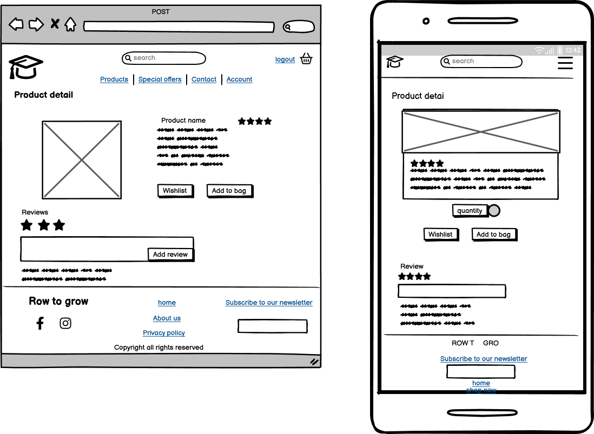

# Row to grow

Row to grow is a fictional website(for educational purposes) for a rowing community. On this website site user can find and purchase products related to rowing, as well as read recent blog posts. Site user can also subscribe to our newsletter or simply contact us for further questions. Register user can leave comments on blog posts, rate our products and save his profile/delivery information for future purchase.
 
  

[Click Here To Visit Live Site]()  

## Table Of Contents:
1. [Design & Planning](#design-&-planning)
    * [Business model](#business-model)
	* [Marketing strategies](#user-stories)
    * [SEO](#seo)
    * [User Stories](#user-stories)
    * [Wireframes](#wireframes)
    * [Agile Methodology](#agile-methodology)
    * [Typography](#typography)
    * [Colour Scheme](#colour-scheme)
    * [Database Diagram](#database-diagram)
   
2. [Features](#features)


3. [Future Features](#future-features)
4. [Technologies Used](#technologies-used)
5. [Testing](#testing)
6. [Bugs](#bugs)
7. [Deployment](#deployment)
8. [Credits](#credits)
9. [Acknowledgements](#acknowledgements)

## Design & Planning:
### Business model
- Row to Grow is an e-commerce website that specializes in rowing-related products, such as clothing, accessories, and education. Our business model is centered around providing high-quality products at affordable prices, with a focus on serving rowing community. We believe that by focusing on the needs of our customers and providing excellent customer service, we can establish ourselves as a trusted and respected brand in the rowing community and beyond since we also have products that are not so called "rowing-related" and are more "mainstream"
 - To achieve our business goals, we carefully select our suppliers based on the quality of their products, their reputation in the industry, and their commitment to sustainable and ethical practices. 
 - To support our business model, we have implemented a range of operational strategies to ensure that we can deliver the best possible customer experience. We offer fast and reliable shipping, easy returns and exchanges, and a customer support team that is available to answer any questions or concerns.By prioritizing customer satisfaction, we believe that we can build long-term relationships with our customers and establish ourselves as a good provider of sports related products.

### Marketing 
#### B2C 
The application is primarily B2C focused, catering to individual customers who wish to purchase rowing related products

#### Strategies
- At Row to Grow, we understand the importance of effective marketing strategies to drive traffic to our website and increase our sales. Our current marketing strategies include:

- Social Media: We have created a [Facebook](https://www.facebook.com/profile.php?id=100092653627209) and [Instagram](https://www.instagram.com/rowto_grow/?fbclid=IwAR1LHVbMfc3Ypo-tBhXvJH1TNpzzMbn2iyowSml0UgkYor25RQ4zspwrwGU) page for our business to reach out to potential customers and promote our products. By regularly posting engaging content and interacting with our followers, we aim to build an online presence to increase our brand awareness. Our both pages are live and active but in case they becomes inactive or deactivated I have taken screenshots to display here as well

<details><summary>Facebook1 page</summary>

</details>

<details><summary>Facebook2 page</summary>

</details>

<details><summary>Facebook3 page</summary>

</details>


<details><summary>Instagram1 page</summary>

</details>

<details><summary>Instagram2 page</summary>

</details>

- Newsletter: We offer a newsletter subscription service to keep our customers up-to-date with our latest products and promotions. By offering exclusive deals and promotions to our subscribers, we aim to foster customer loyalty and encourage repeat business. Upon subscription user receive our initial conformation email.

- Partnerships: We have established partnerships with local rowing clubs to promote our products and build brand awareness within the local rowing community. By attending local events and sponsoring local athletes, we aim to establish ourselves as a trusted and respected brand within the community.Also by sponsoring local athletes we extend our reach in marketing area in an old fashion way "Word of a mouth"

SEO: We understand the importance of effective SEO strategies to increase our website's visibility in search engines like Google which will be explained more in next section.

### SEO
- When planning the SEO strategy for Row to Grow, our e-commerce website focused on rowing-related products, we began by conducting thorough keyword research. We utilized semrush.com and wordtracker.com to identify short tail and long tail keywords that we could use to improve our search engine rankings.

- Our short-tail keywords include terms such as "Rowing Products, Rowing Accessories, Rowing Clothing, Rowing Books, Rowing Gear, Rowing Equipment, Rowing Apparel, Rowing Gift, Rowing" while our long-tail keywords are more specific and include phrases like "Rowing clothing for women, Rowing clothing for men, Rowing books for beginners, Rowing gear for student rowers, Rowing equipment for competitive rowers, Rowing equipment for coaches, Rowing gifts for enthusiasts" By analyzing the results from Google Trends and related search queries, we were able to generate a comprehensive list of targeted keywords.

- We strategically placed these keywords throughout our website, ensuring that they were included in important on-page elements such as headings, descriptions, and URLs. We also made use of the Strong tag where necessary to highlight key phrases and improve our website's overall searchability.

### User Stories

#### Site visitor
- As a site visitor, I want be able to register for the account so that I can get more access to the website content and to store my profile information
- As a site visitor, I want to be able to view list of the products so that I can select some to purchase
- As a site visitor I want to be able to sort the list of specific category or product so that I can easily find products of certain price, rating and name
- As a site visitor I want to be able to search for a product by name or description so that I can easily find specific product
- As a site visitor, I want to be able to view details of the products so that I can identify, price, description, rating, image and available sizes of the product
- As a site visitor I want to be able to chose products and select size and quantity of the product
- As a site visitor I want to be able to pay for selected products so that I can complete my purchase option
- As a site visitor, I want be able to view blog posts so that I can get more knowledge about benefits of related selling products on the website
- As a site visitor, I want to be able to subscribe to newsletter so that I can receive promotions and informations about new products
- As a site visitor, I want to be able to contact site owner so that I can get answers to any enquires that I have about the products or website
#### Registered user
- As a registered user, I want to be able to login and logout from the website
- As a registered user, I want to be able to recove my password so that I can recover access to my account in case I forget my password
- As a registered user, I want to be able to update my profile and delivery information
- As a registered user, I want to be able to leave comments for posts so that I can engage with other users and leave feedback about certain posts
- As a registered user, I want to be able rate the products so that I can express my satisfaction or disatisfaction of the certain products
- As a registered user, I want to be able to view my order history on the profile page so that I can have better insight of my previous purchases
#### Site owner
- As a site owner, I want to be able to create, update and delete posts so that I can control my website content
- As a site owner, I want to be able to approve or delete comments so that I can filter out objectionable comments
- As a site owner, I want to be able to delete users so that I can receive several benefits such as: manage my data, reduce liability & resource optimization
- As a site owner I want to be able to add, update and delete products directly from the website so I don't have to access admin panel everytime I want to make changes to the products


### Wireframes
Below are the wireframes for the site that I created using balsamiq. As I was developing my website I was using agile approach and adding/updating my website/elements so for that reason some wireframes are not matching my final product.

<details><summary>Home page</summary>

</details>

<details><summary>All products</summary>

</details>

<details><summary>Contact</summary>

</details>

<details><summary>Product detail</summary>

</details>

<details><summary>Checkout</summary>

</details>

<details><summary>Account</summary>

</details>

<details><summary>Wishlist</summary>

</details>

<details><summary>Order history</summary>

</details>

<details><summary>Delivery information</summary>

</details>

<details><summary>Purchase conformation</summary>

</details>

<details><summary>Shooping bag</summary>

</details>

<details><summary>About us</summary>

</details>

### Agile Methodology
During the development of this project, I implemented Agile development practices to ensure a flexible and iterative approach to the project's progress. The Agile methodology enabled me to adapt to changing requirements and efficiently manage the development process of this project. It is still a learning process for me as this was only my second time doing it so I found that quite bit challenging and time-consuming. I've created Kanban board to manage and visualize the workflow. 
 - Project board was divided into 3 sections:
   - To-Do- (all user stories were initially entered in the 'To Do' column)
   - In Progress- (then during the development phase and implementing functionality stories were moved into the 'In Progress' column)
   - Done- (and then finally they get moved into 'Done' once the development completes and functionality is implemented to cover that user story)

- I've planned 3 iterations for this project. Two were completed as planned and the third one is for future development of the webiste, which is described more in feature features in this document

- Each milestone consists of user stories, which are displayed either open or closed depending on the progress. Each user story is labeled either as 'must-have', 'should-have', or 'could-have' depending on the needs of the project with estimated story points attached to it.

- Each user story has acceptance criteria and tasks that needed to be done to accomplish that criteria

I do realize the importance of the agile approach and documenting all steps and procedures, but it is quite challenging when you are just a team of 1 and you have to write and do everything like multiple people are working on this project. I do think with time and practice better implementation of the methodology can be achieved.


### Typography
For this project I picked Montserrat which is a widely used font known for it's clarity, and versatility. It's clean and modern design makes it suitable for a wide range of applications, including headings, body text, and branding. As a backdrop font I've used 'Sans-serif'.

### Color scheme

### Database 

<details><summary>Database</summary>

</details>

# Features

 Navigation: 
  - navigation was coded along the walkthrough video with some modifications. I believe that navigation from a walkthrough video is a good example of an e-commerce website as it displays features like a shopping bag & search bar which indicates what type of website it is
  - navigation sticks on top of the page and it's divided into 2 sections/ rows. The first row consists of the website logo, search bar, login/logout/register button, and basket. The second row displays different pages on the website and the number of displayed links depends if it's site visitor, registered user, or superuser
  - when on medium to small screens the navigation menu changes to the burger menu which shows all the nav links when clicked on

- Product page:
  - products page is fully responsive to allow equal spacing between products regardless of screen width
  - each product consists of an image, title, price, category & rating, special fields are displayed for the superuser which will all be covered in features: "admin"
  - pagination is created to display only 8 products per page

- Product detail page:
    - single product is displayed on a page with additional information and various option for the user such as a description of the product, an option to pick sizes, quantity and 'add to bag' button
    - additional features 'add to wishlist & 'add review' are displayed only for registered users
    - for both features, there is displayed paragraph text to indicate to the user that he needs to login in order to get more access to the website
    - if a user reviews our product it will be indicated with a toast message
    - once the superuser approves the review, the registered user has the option to update it or delete its review
- The account page is only displayed to registered user
    - Wishlist:
        - if there are products on the page user can delete a product or add a product to the bag
        - if there are no products text paragraph is displayed on the page, indicating user with the link that he can go to the product page to add products to a wishlist
    - Security:
        - this page allows the user to update his password
        - 3 input fields with confirm button, also help text how to set password is displayed on the page
    - Order history
        - previous orders are displayed with clickable order numbers for each
        - link for each order number will redirect the user to the purchase confirmation summary for that order
    - Purchase confirmation
        - allows a user to have a detailed view of his purchase
        - allows a user to download a pdf version of the receipt
    - Profile info
        - displayed as a simple form for a user to update his delivery information which will be saved
- Bag page
    - as it might increase our business and drive more traffic to our website unregistered users can purchase our products
    - shopping bag is accessible simply by clicking the bag icon in the navigation menu, or during the shopping user can click on the 'secure checkout' button
    - all products that the user has decided to purchase are displayed on the template, also there is an option for a user to change the quantity of the product or to remove it from the bag
- Checkout page
    - page is divided into two sections, order summary, and input form
    - if a user is registered and has saved his profile information in the 'account', the checkout form will be pre-populated with his information
    - if a user is registered and doesn't have saved information on his profile after he populates all the fields he can tick the checkbox to save his information for future purchases
    - site visitors will have to populate all the fields in the form
    - both registered and site visitors are required to provide card details to finalize a purchase
    - upon completion of the purchase user is redirected to view his purchase in the separate template
- Contact page
    - designed as a separate app and model to store data
    - standard contact form input fields are displayed for the user with a conformation toast message displayed after submission and a confirmation email sent to the user address
- Footer
    - displayed on the bottom of every page, colors are matching footer display
    - divided into 3 sections
        - 1: Displayed name of the website with social icon links
        - 2: Quick links that lead a user to the other parts of the website which increases engagement and gives a feel of the more content/complexity of the website
        - 3: Subscription field, which allows users to subscribe to our newsletter and offers. Same as the contact form it is created as a separate model which will save the user's email address and toast messages and confirmation emails are sent to the user
- Additional pages were created to give more credibility to our business
    - About us
        - simple layout page with text and images, which provides users with more information about our business
    - Privacy policy
        - a document that explains how we handle any customer information gathered in its operations
    - Return policy
        - a document that explains our return policy on purchased products
- Admin-related permissions
    - as a superuser, you get more access to the website, 2 additional tabs are displayed in the navigation menu:'admin' which will lead the superuser to the admin panel, and 'add product' which will get a user to the new page which he can add a product directly from the website without using admin panel
    - as a superuser, you can also delete and update products on the website without having to access the admin panel
    - also as a superuser you can choose which reviews/ratings you want to approve from registered users

# Future features

# Technologies used
- [Balsamiq](https://en.wikipedia.org/wiki/Balsamiq) was used to create the wireframes.
- [LucidChart](https://www.lucidchart.com/pages/) was used to design the database schema.
- [HTML](https://en.wikipedia.org/wiki/HTML) was used for the mark up.
- [CSS](https://en.wikipedia.org/wiki/CSS)  was used to style the site.
- [Django](https://www.djangoproject.com/) was the framework that was used.
- [Python](https://en.wikipedia.org/wiki/Python_(programming_language)), used for the logic in this project
- [Bootstrap](https://en.wikipedia.org/wiki/Bootstrap_(front-end_framework)) was also used to style the site.
- [JavaScript](https://en.wikipedia.org/wiki/JavaScript) was used for interactiveness.
- [Gitpod](https://www.gitpod.io/about) was used to create this site and then push everything to github.
- [Heroku](https://en.wikipedia.org/wiki/Heroku) is used to host this site.
- [Heroku PostgreSQL](https://en.wikipedia.org/wiki/Heroku) was used as a database for this project during development
- [Github](https://en.wikipedia.org/wiki/GitHub) was used to store the code.
- [Git](https://en.wikipedia.org/wiki/Git) was used for version control.
- [AWS S3 and IAM](https://eu-north-1.console.aws.amazon.com/) was used to host static and media files for this project and IAM for the permissions based roles for accessing the S3 buckets.
- [ElephantSQL](https://www.elephantsql.com/) was used to store the database.
- [Grammarly](https://app.grammarly.com/) was used to check typography.
- [w3c Markup Validator](https://validator.w3.org) was used to validate code
- [Am I Responsive?](http://ami.responsivedesign.is) was used to display site on different devices
- [PEP8 CI Python Linter](https://pep8ci.herokuapp.com/) was used to check that the Python code meets PEP8 standards.
- [JSHint](https://jshint.com/)  was used to validate the Javascript code
- [Jigsaw CSS validator](https://jigsaw.w3.org/css-validator/) was used for validating the CSS stylesheet. CSS file was tested by manually copying the CSS codes into the manual input option.

# Testing

# Bugs
| **Bug** | **Fix** |
| ----------- | ----------- |
| t-shirt product not displaying on the product page| spellcheck correct in tshirt in code|
| Post page was not displaying| Change path in urls.py to post/ |
| only 4 products displayed on the page | removed divisible counter from walkthrough project for smaller screens and medium screen|
| webhooks not working locally for stripe payments| clicked "share" in my local workspace|
| order total, delivery and grand total amounts not displaying in admin panel | update signals.py function name, add 'self.save() in update_total function in models |
| git push was rejected because changes I made in README.md in github, need to integrate remote changes | run commands in the console git-'fetch, checkout main, merge origin/main, commit and push" |
| server 500 error after purchase of the product on the stripe-webhook website | import stripe on the top of the webhook_handler.py |
| not able to download order receipt as pdf file | Created separated function to display blank canvas and manually inputed fields in the function|
| receipt not rendering as order history template, error "template does not exist"| created same template and placed it in the profile app |
| no autofill on the checkout page with user information| added if request.user.is_authenticated block of code with functionality in the checkout function|
| server 500 error on the live version of the website when tried to upload images from admin panel or website | removed trailing whitespace in config vars "AWS_SECRET_ACCESS_KEY"'|
| rating radio boxes on hover effect where changing colors from right to left (2 were higlighted as 4)| created div and add css to display flex, row-reverse and placed rating in that div|

# Deployment
## Create an external database

Sign in or create an account with [ElephantSQL](https://www.elephantsql.com/).

If you don't have an ElephantSql account follow the below steps:

1.  On the [Home Page](https://www.elephantsql.com/) click "Get a managed database today"
2.  Select "Try now for FREE" within the TINY TURTLE database plan
3.  Select "Log in with GitHub", select your GitHub account and click "Authorize ElephantSQL"
4.  Add your email address and click "Create team". This will crteate your ElephantSQL account.

You can now create the database for the project.

- In the ElephantSql dashboard select the "+ Create New Instance" button
- Give the instance a name and select region that is closest to your location.
- Click review button and make sure everything is inputed correctly
- Back in the ElephantSQL dashboard click the databse name you just created and copy URL


## Create an app on Heroku

Sign in or create an account with [Heroku](https://www.heroku.com/)

- In the Heroku dashboard use the New tab to create a new app.

- Name the app and choose a region.

- Click on the settings tab and select "Reveal Congig Vars".

  - Add DATABASE_URL with the value of the database URL copied from ElephantSQL

- Enter the following command in to your terminal to install dj_database and psycopg2. These are needed to connect to the database.

```pip3 install dj_database_url==0.5.0 psycopg2```

Followed by ```pip freeze > requirements.txt``` to update requirements.txt.

Add ``` import dj_database_url``` below import os in settings.py

In the DATABASES section of the settings comment out the initial settings and place the following underneath:

```
DATABASES = {
     'default': dj_database_url.parse('your-database-url-here')
 }
```

Migrate the models to the database using
```
 python3 manage.py migrate
```

Create a superuser and supply a username and password:
```
 python3 manage.py createsuperuser
```

Within the Django admin confirm the email address

Change the DATABSE settings to the following:

```
if 'DATABASE_URL' in os.environ:
    DATABASES = {
        'default': dj_database_url.parse(os.environ.get('DATABASE_URL'))
    }
else:
    DATABASES = {
        "default": {
            "ENGINE": "django.db.backends.sqlite3",
            "NAME": os.path.join(BASE_DIR, "db.sqlite3"),
        }
    }
```

Install [Gunicorn](https://gunicorn.org/) webserver:

```
pip3 install gunicorn
```

Create a file named Procfile in the root of the project and add:
```
web: gunicorn 'name-of-your-project'.wsgi:application
```

Add the required dependencies to requirements.tc with:
```
pip3 feeze > requirements
```

Add the following to settings:
```
ALLOWED_HOSTS = ["'name-of-the-website'.herokuapp.com", "localhost"]
```

Add changes, commit and push to GitHub and Heroku
```
git add . 
git commit -m "Deployment"
git push
git push heroku main
```


## Set up hosting of static and media files with AWS

1.  Sign in or create an account with [Amazon Web Server](https://aws.amazon.com/)

2.  Navigate to the AWS Console home

3.  Search for "s3" in the search bar

4.  Click on "Create bucket"

5.  In the Create bucket page add the following information:

- A name for the bucket. It is recomeneded to use the same name you gave your Heroku app.

- A region closest to you.

- Select ACLs enabled

- Uncheck the "Block all public access" checkbox

- Check the box beside "I acknowledge that the current settings might result in this bucket and the objects within becoming public."

Scroll to the bottom of the page and select "Create bucket"

6.  Click on the new bucket you just created.

7.  In the "Properties" tab scroll to the bottom of the page and in Static website hosting
click "Edit".

8.  Select "Enable" and paste the following in the the "Redirection rules – optional" at
the bottom of the page:

```
[
    {
        "AllowedHeaders": [
            "Authorization"
    ],
    "AllowedMethods": [
        "GET"
    ],
    "AllowedOrigins": [
        "*"
    ],
        "ExposeHeaders": []
    }
]
```

9.  In the "Permissions" tab click on the "Edit" button underneath Bucket policy

10.  Copy the "Bucket ARN" and click on "Policy generator"

11.  On the next page:

- Select "S3 Bucket Policy"

- Add * (an asterik) as the "Principal" value

- Select "GetObject" in the "Actions" dropdown

- Paste the "Bucket ARN" (from step 10 above) as the Amazon Resource Name (ARN)

- Click "Add Statement" then "Generate Policy"

- Copy the policy shown in the pop-up box

12.  Back in the AWS "Edit bucket policy" paste the policy just copied.

13.  At the end of the resource key but before the closing quotation mark add: 
```
/*
```

and click "Save"

14. On the next page click "Edit" in the "Access control list (ACL)" section.

- Enable "List" for "Everyone (public access)"

- Accept the warning

## Back in AWS services menu

1. Select "IAM" from the AWS menu and then "User groups" from the menu on the left 
hand side.

2.  Click the "Create group" button

3.  Give the group a name and click "Next step", then on the next page "Next step" agin.

4.  Click the "Create group" button

5.  Select "Polices" from the menu, then "Create policy" button.

6.  In the JSON tab select "Import managed policy" link

7.  Add "s3" into the search bar, select "AmazonS3FullAccess" and click "Import"

8.  Paste in the Bucket ARN and the Bucket ARN followed by /* as the Resource values

9.  Click "Review policy" and add a name and description and click "Create policy"

10.  Select "Groups" from the menu and select the group you made in Step 3.

11.  Click "Attach policy", search and select the policy just created.

12.  Click "Attach policy"

# Add a user to the group

1.  Select "Users" in the menu, then click "Add user"

2.  Add a user name and check the "Programatic access" checkbox for Access type

3.  Select "Next: Permissions"

4.  On the following page check the name of your added user group

5.  Click through the next pages until you can click the "Create user" button

6.  Navigate on user page to 'security credentials'

7. Click on 'Create access key'

8. After they are created click on 'download.csv' file


## Connect Django

1. Install boto3 and django-storages:

```
pip3 install boto3
pip3 install django-storages
```

2.  Add above to requirements.tct:
```
pip3 freeze > requirenets.txt
```

3.  Add "storages", to INSTALLED_APPS in seetings.py

4.  Paste the following in settings.py:
```
if 'USE_AWS' in os.environ:
    # Cache control
    AWS_S3_OBJECT_PARAMETERS = {
        'Expires': 'Thu, 31 Dec 2099 20:00:00 GMT',
        'CacheControl': 'max-age=94608000',
    }
    # bucket config
    AWS_STORAGE_BUCKET_NAME = 'row-to-grow'
    AWS_S3_REGION_NAME = 'eu-west-1'
    AWS_ACCESS_KEY_ID = os.environ.get('AWS_ACCESS_KEY_ID')
    AWS_SECRET_ACCESS_KEY = os.environ.get('AWS_SECRET_ACCESS_KEY')
    AWS_S3_CUSTOM_DOMAIN = f'{AWS_STORAGE_BUCKET_NAME}.s3.amazonaws.com'
```

5.  Paste the following in settings.py:
```
    # Static and media files
    STATICFILES_STORAGE = 'custom_storages.StaticStorage'
    STATICFILES_LOCATION = 'static'
    DEFAULT_FILE_STORAGE = 'custom_storages.MediaStorage'
    MEDIAFILES_LOCATION = 'media'

    # Override static and media URLs in production
    STATIC_URL = f'https://{AWS_S3_CUSTOM_DOMAIN}/{STATICFILES_LOCATION}'
    MEDIA_URL = f'https://{AWS_S3_CUSTOM_DOMAIN}/{MEDIAFILES_LOCATION}'
```

## Back in Heroku

1.  Select "Reveal Config Vars" in the "Settings" tab

2.  Add the variables "AWS_ACCESS_KEY_ID" and "AWS_SECRET_ACCESS_KEY" with the 
values from the credentails.csv file from Step 6 in Add a user to the group above

3.  Add an additioanl "USE_AWS" variable with the key of "True"


## In the root directory of the project

1.  Create a file named "custom_storages.py"

2.  Paste in the following:
```
from django.conf import settings
from storages.backends.s3boto3 import S3Boto3Storage


class StaticStorage(S3Boto3Storage):
    location = settings.STATICFILES_LOCATION


class MediaStorage(S3Boto3Storage):
    location = settings.MEDIAFILES_LOCATION
```

3.  Add and commit then push the project to GitHub. If you haven't set up automatic deployment
to Heroku, also deploy to Heroku.

 ## In AWS

 1.  Add a folder named "media" in the S3 bucket page

 2.  Click "Upload" in the media folder

 3.  Select the images used on the site and click "Next"

 4.  Select "Grant public read access to this object(s)" under Manage public permissions,
 click "Next" then "Next" again

 5.   Click "Upload"

## Stripe

1.  Sign in or create an account with [Stripe](https://stripe.com/gb)

2.  Click "Developers" from the menu on the left hand side and then "API keys"

3.  Copy the "Publishable key" and "Secret key"

4.  Add these to Heroku Config Vars as STRIPE_PUBLIC_KEY and STRIPE_SECRET_KEY respectivaely.

5.  Click "Webhooks" from the Developers tab and then "+ Add endpoint"

6.  Enter the following as the "Endpoint URL":
```
https://'your-website-name'.herokuapp.com/checkout/wh/
```

7.  Select "Recieve all events" and then "Add endpoint"

8.  Copy the "Signing secret"

9.  Add the "Signing secret" to Heroku Config Vars as STRIPE_WH_SECRET

# Credits
- 
### Tutorials and inspiration

* The project walkthrough Butique Ado from Code Institute
# Acknowledgment

## Acknowledgements:
- I would like to thank my mentor ``Narander Singh`` for all his help throughout the project and guidance in general over the last 6 months. Narander was extremly proffesional and I would highly reccomend him to contionue to provide his guidance and support to the new students
- I would like to thank Code Institute in general for providing me this opportunity then Slack Community, and tutor support which were amazing. I'm not sure if they are their real names but ``Sean, Oisin, Ed, Sarah`` were there when I needed them and got stuck on my project
- I would also like to thank our cohort facilitator ``Irene Neville``, for beeing here with us for the last 6 months. Her guidance and advices made this whole experience so much better
- Last but not least I would like to thank my colleagues in the classroom for daily guidance and code review

[Back to the top](#row-to-grow)